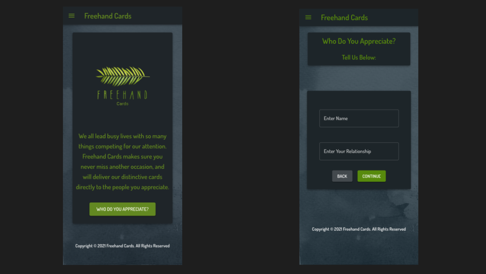

# Freehand Cards

## Description

_Duration: 2 Week Sprint_

The Freehand Cards app is a service for busy people: people with bosses, employees, family and friends, who have Google calendars that quickly fill up with meetings, deadlines, school plays and doctor's appointments. It's an app for people who don't want to miss acknowledging important occasions for the people who they appreciate, but always seem to find themselves in the greeting card aisle at a drug store trying to find the best card from the available options. 

This app allows the user to create events for the people that are important to them, specifying the occasions they want to recognize and categories that fit the person & event that they want to celebrate. Freehand Cards will send the user an emailed reminder two weeks before the occasion and when the user follows the emailed link to the app, they are able to choose a card for their person that is curated for them. 

The app features a dashboard that highlights the next event that the user has recorded, a persons view to see all the people the user has entered into the app with all of their special occasions, the ability to edit any of these events, and a shuffle feature for the cards recommended to get different suggestions.

There are 2 Admin view pages, one to add new cards to the database and a second to add Categories and Occasions to the app, expanding the options for card selection/ management.

To see the fully functional site, please visit: [DEPLOYED VERSION OF APP](www.heroku.com)

## Screen Shot

### Prerequisites

Link to software that is required to install the app (e.g. node).

- [Node.js](https://nodejs.org/en/)
- List other prerequisites here

## Installation

How do you get your application up and running? This is a step by step list for how another developer could get this project up and running. The good target audience in terms of knowledge, would be a fellow Primer from another cohort being able to spin up this project. Note that you do not need a paragraph here to intro Installation. It should be step-by-step.

If your application has secret keys (for example --  Twilio), make sure you tell them how to set that up, both in getting the key and then what to call it in the `.env` file.

1. Create a database named `your database name`,
2. The queries in the `tables.sql` file are set up to create all the necessary tables and populate the needed data to allow the application to run correctly. The project is built on [Postgres](https://www.postgresql.org/download/), so you will need to make sure to have that installed. We recommend using Postico to run those queries as that was used to create the queries, 
3. Open up your editor of choice and run an `npm install`
4. Run `npm run server` in your terminal
5. Run `npm run client` in your terminal
6. The `npm run client` command will open up a new browser tab for you!

## Usage
How does someone use this application? Tell a user story here.

1. xxx
2. xxx
3. xxx
4. xxx
5. xxx
6. xxx

## Built With

List technologies and frameworks here

## License
[MIT](https://choosealicense.com/licenses/mit/)

_Note, include this only if you have a license file. GitHub will generate one for you if you want!_

## Acknowledgement
Thanks to [Prime Digital Academy](www.primeacademy.io) who equipped and helped me to make this application a reality. (Thank your people)

## Support
If you have suggestions or issues, please email me at [youremail@whatever.com](www.google.com)