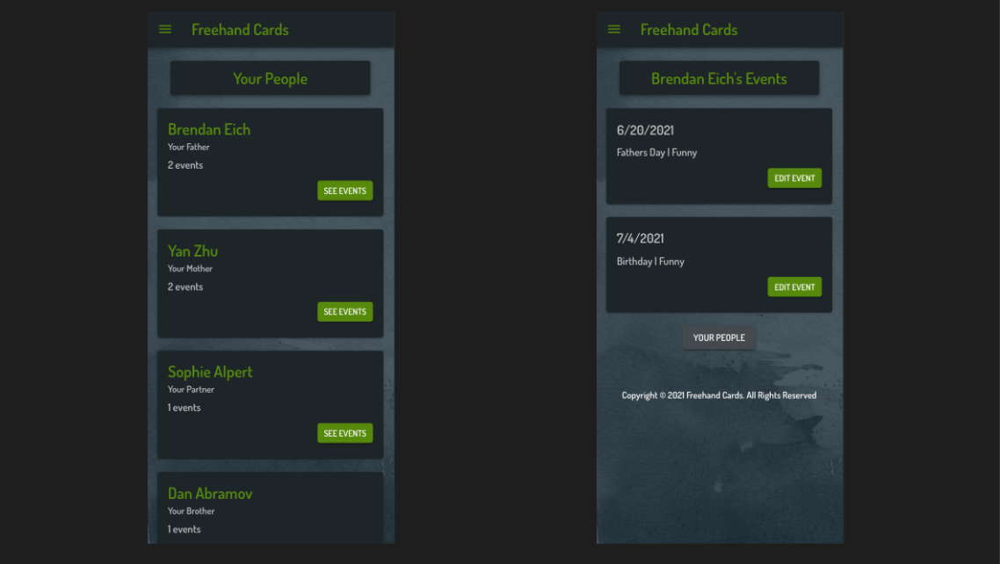

# Freehand Cards

## Description

_Duration: 2 Week Sprint_

The Freehand Cards app is a service for busy people: people with bosses, employees, family and friends, who have Google calendars that quickly fill up with meetings, deadlines, school plays and doctor's appointments. It's an app for people who don't want to miss acknowledging important occasions for the people who they appreciate, but always seem to find themselves in the greeting card aisle at a drug store trying to find the best card from the available options. 

This app allows the user to create events for the people that are important to them, specifying the occasions they want to recognize and categories that fit the person & event that they want to celebrate. Freehand Cards will send the user an emailed reminder two weeks before the occasion and when the user follows the emailed link to the app, they are able to choose a card for their person that is curated for them. 

The app features a dashboard that highlights the next event that the user has recorded, a persons view to see all the people the user has entered into the app with all of their special occasions, the ability to edit any of these events, and a shuffle feature for the cards recommended to get different suggestions.

There are 2 Admin view pages, one to add new cards to the database and a second to add Categories and Occasions to the app, expanding the options for card selection/ management.

To see the fully functional site, please visit: [DEPLOYED VERSION OF APP](www.heroku.com)

## Screen Shot

## Prerequisites & Installation

How do you get your application up and running? This is a step by step list for how another developer could get this project up and running. The good target audience in terms of knowledge, would be a fellow Primer from another cohort being able to spin up this project. Note that you do not need a paragraph here to intro Installation. It should be step-by-step.

If your application has secret keys (for example --  Twilio), make sure you tell them how to set that up, both in getting the key and then what to call it in the `.env` file.

1. Create a database named `your database name`,
2. The queries in the `tables.sql` file are set up to create all the necessary tables and populate the needed data to allow the application to run correctly. The project is built on [Postgres](https://www.postgresql.org/download/), so you will need to make sure to have that installed. We recommend using Postico to run those queries as that was used to create the queries, 
3. Open up your editor of choice and run an `npm install`
4. Run `npm run server` in your terminal
5. Run `npm run client` in your terminal
6. The `npm run client` command will open up a new browser tab for you!

## Usage
How does someone use this application? Tell a user story here.

1. When the app opens, the user finds themselves at the landing page. There is a pleasant introduction to the purpose of the app and a button that says "Who do you appreciate?" The user presses the button. A returning user can press the hamburger menu and chose to log in and skip to Step 6.
2. The user is asked to enter the name of a person they appreciate and their relationship. (if the user is logged in, they will also see a Select menu of people they've already included in the app). The user presses continue.
3. The user will be asked to select an occasion that they would like to be reminded of and a date for that occasion. The user presses continue.
4. The user will be asked to select a category for that occasion, this will help in getting tailored card selections for the occasion later. The user presses continue.
5. The first time user is asked to register for the app with an email and a password, this will store the event in the user's profile as well as provide the email where the user will receive the reminder for the event. The logged in user's experience skips to the next step.
6. The user finds themselves at their dashboard. From here the user sees the next event that is coming up and buttons to add an additional event and a button to view their people. Adding an additional event follows the same path as the new user, entering the previously described info. Pressing view people continues with Step 7.
7. At View People, the user sees cards with all of the people that they have added to the app, with the name, relationship and number of events listed. Each card has a button to See Events.
8. Selecting See Events brings the user to another screen with cards listing the date, occasion, and category for each event with a button to Edit the Event.
9. Pressing Edit Event, the user is brought to a page where they will see a card (if one is selected), with a button that allows the user to select a new card. There are also fields to edit the person's name, occasion, date, and category, with the ability to change those fields. There are buttons to Delete the event, Update (save changes) the event, or Cancel the edit and go back. There is also a button for shipping (selecting Shipping skips to Step 11).
10. If a user is reminded of an event and they follow that link, they are brought to a page to select a card for the occasion. They are given 3 cards with suggested options for cards that include the image, artist, and a description of the card. Pressing on the image allows the user to see the inside of the card. Pressing on the button Choose This Card, selects the card and a Dialog pops up that asks the user to confirm that they want to select that card, or go back to select a card. If the user doesn't like the options presented, they can press the button See New Cards to shuffle and provide 3 new card options. Pressing Select this Card completes the process and advances the user to Shipping.
11. On the Shipping page, the user is provided with the details of the occasion and the selected card and is asked if everything looks correct. They are able to select a radio button for Ship to Me or Ship to Them. If Ship to Them is selected, a field appears to enter an address for the recipient of the card. There is also a field to enter an optional inscription for the card. If the user selects the Submit button, a Dialog pops up confirming that the card will be shipped to the recipient and be delivered by the event date. The user needs to choose Submit from the Dialog to complete the process and be returned to their Dashboard.
12. An admin has two pages, best viewable from Desktop. One page allows the user to upload new cards or edit existing cards. Card images are uploaded using Amazon Web Services and there are fields to enter the rest of the card info (occasion, category, artist name, and card description). The second Admin page allows the admin to add or delete occasions and categories to associate with cards in the inventory.

## Built With

React, Redux, Nodejs, Express, PostgreSql, Material-UI, Nodemailer, Node-Cron, AWS-Amazon Web Services, Passport

## Acknowledgement
Thanks to [Prime Digital Academy](www.primeacademy.io) who equipped and helped me to make this application a reality. (Thank your people)

## Support
If you have suggestions or issues, please email me at [youremail@whatever.com](www.google.com)